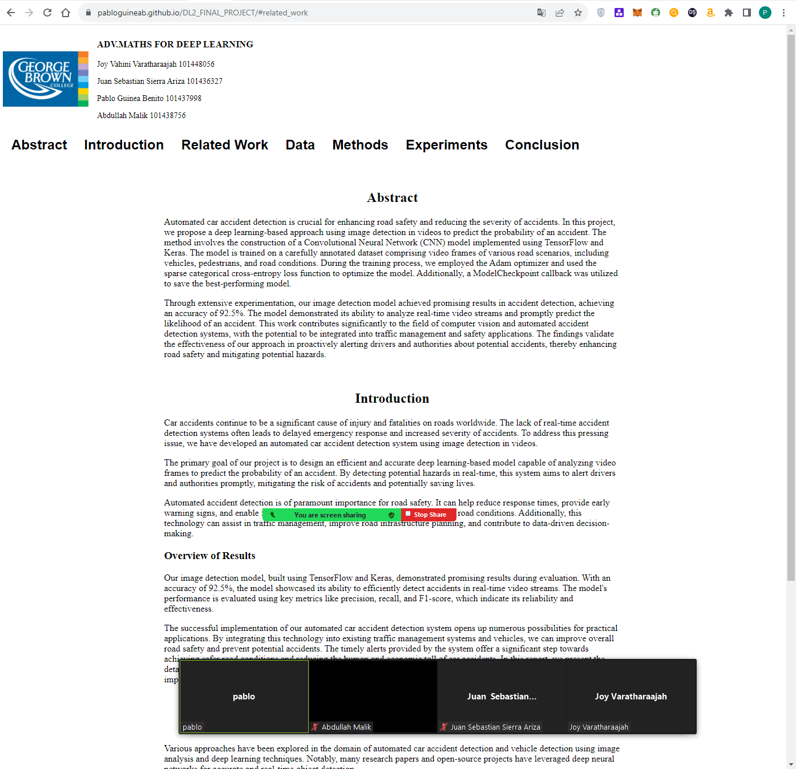
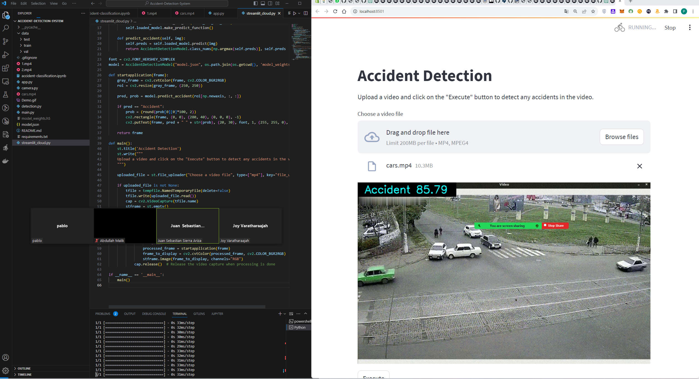
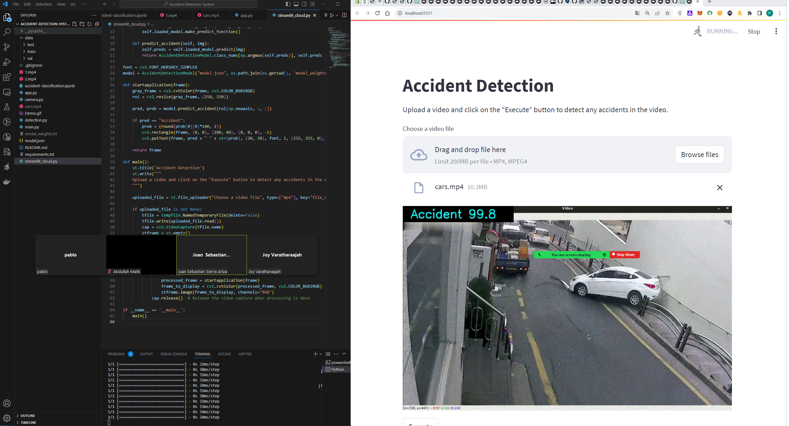
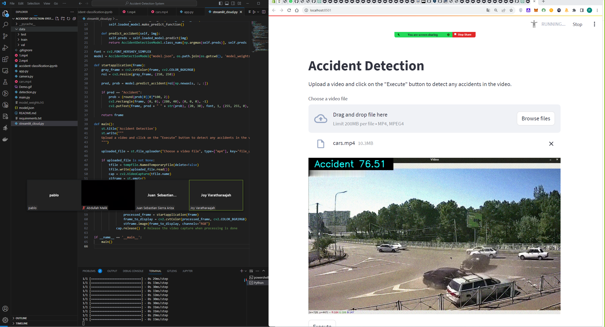

# DL2_FINAL_PROJECT

This project implements an Accident Detection System that uses Convolutional Neural Networks (CNN) and Computer Vision techniques to detect accidents in videos. The system is built using the Keras library for deep learning and Streamlit for creating an interactive web application.

## Project Report

The detailed report for this project is available on [GitHub Pages](https://pabloguineab.github.io/DL2_FINAL_PROJECT/).

To view each section of the report, double click on the name of the section in the navigation bar (navbar) on the website.

### Report Screenshot

## Streamlit App Screenshots

## Running the Streamlit Application Locally

To deploy the Streamlit application on your local machine, please follow these steps:

1. **Clone the Repository**: 

git clone https://github.com/pabloguineab/DL2_FINAL_PROJECT.git

2. **Install the Requirements**: 
Navigate to the project folder and install the necessary dependencies.

3. **Download and Prepare the Dataset**: 
You can download the required dataset from [this link on Kaggle](https://www.kaggle.com/datasets/ckay16/accident-detection-from-cctv-footage) and place it in the project folder.

4. **Generate the CNN Model**:
Run the `accident_classify.ipynb` notebook to generate the `.h5` file, which represents the CNN model.

5. **Run the Streamlit Application**:
You can now run the application using either `app.py` or `streamlit_cloud.py`.

For any issues or additional information, please refer to the documentation within the project or raise an issue on the GitHub page.
